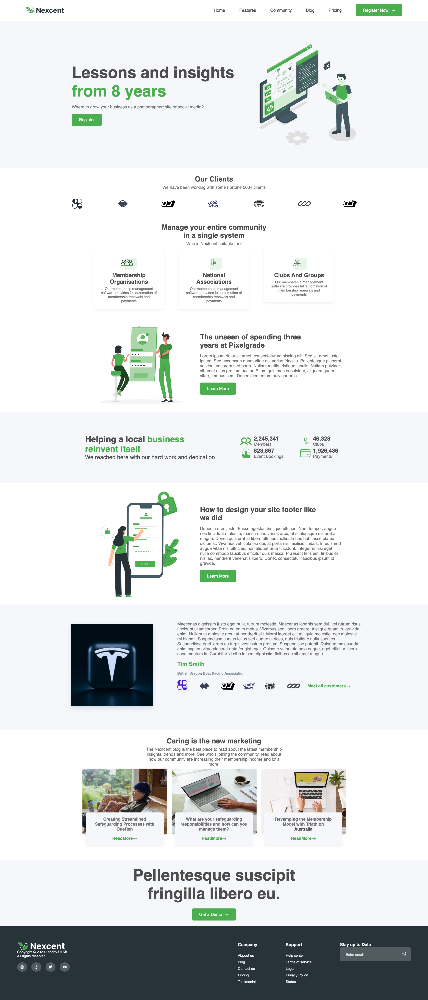

# Responsive Figma-to-HTML Website

This is my first web project — a fully responsive website built with **vanilla HTML and CSS**, based on a Figma design.  
The focus was on **design accuracy, responsiveness, and layout fundamentals** (without frameworks or libraries).

## Features

- ✅ Fully responsive
- ✅ Pixel-perfect implementation of a Figma design
- ✅ Built entirely with HTML & CSS (no frameworks, no JavaScript)  
- ✅ Clean layout and visual consistency  

## Preview



## How to Run

1. Clone the repo:
   ```bash
   git clone https://github.com/hareem-rana/vanilla-html-css-webpage.git
2. Open landing_page.html in your browser. 

## Credits 
* [Minimal Landing Page Design | Website Home Page Design | Agency Website UI Design](https://www.figma.com/community/file/1222060007934600841/minimal-landing-page-design-website-home-page-design-agency-website-ui-design) by Muntasir Billah
* Licensed under [CC BY 4.0](https://creativecommons.org/licenses/by/4.0/)
* Modifications: adapted into a responsive website using HTML and CSS 

## License 
This project is licensed under MIT License. 
